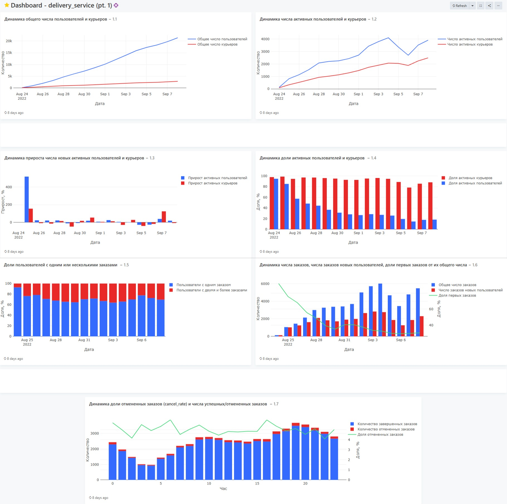
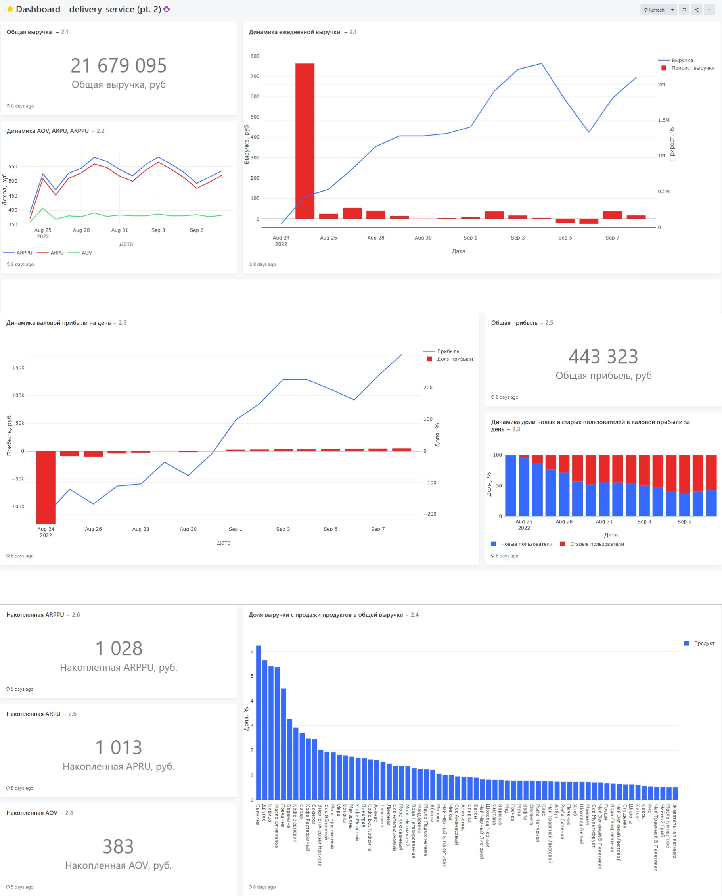
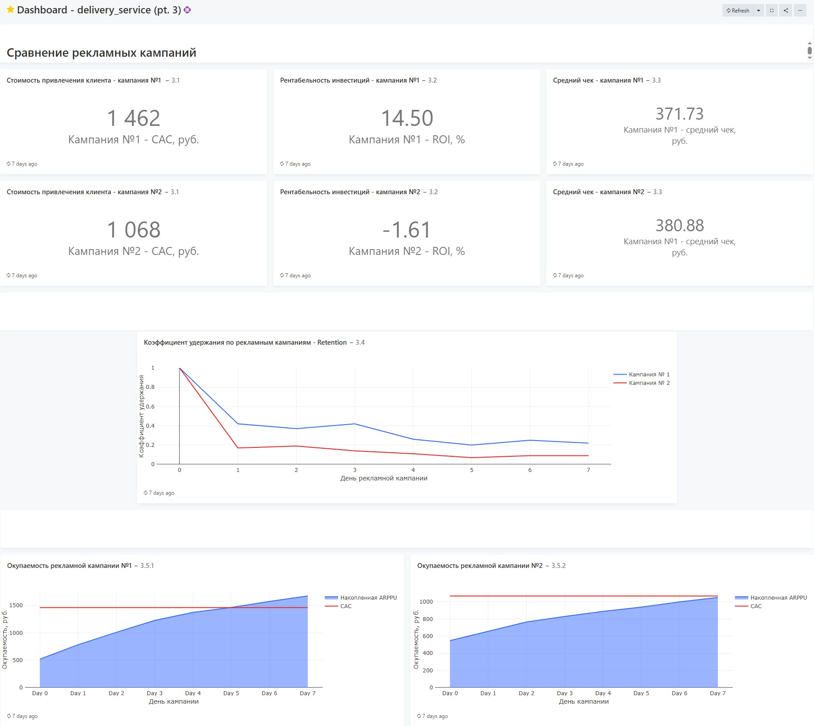

# <b>Разработка аналитических дашбордов для сервиса доставки продуктов</b>

Данный проект содержит дашборды, разработанные для операционного и стратегического контроля сервиса доставки продуктов. Они охватывают три ключевых аспекта бизнеса: <b>отслеживание роста аудитории и активности</b>, <b>анализ финансовых показателей и выручки</b>, а также <b>оценку эффективности маркетинговых кампаний</b>. 

  
  

## <b>Навигация</b>
1. [Описание проекта](#навигация)
2. [Первый дашборд](#первый-дашборд)
3. [Второй дашборд](#второй-дашборд)
4. [Третий дашборд](#третий-дашборд)

## <b>Первый дашборд</b>

Первый дашборд отображает <b>ключевые метрики роста и активности</b> сервиса доставки: ежедневное количество пользователей и курьеров, <b>общее число</b> активных пользователей, <b>долю</b> платящих пользователей, <b>количество</b> заказов, а также <b>показатели успешных и отмененных</b> заказов. Хотя эти метрики дают лишь поверхностное представление о состоянии сервиса, они позволяют отслеживать <b>базовую динамику аудитории</b> и выявлять <b>основные тренды в поведении пользователей</b>.

  

  Рисунок 1. Первый дашборд

## <b>Второй дашборд</b>

Данный дашборд показывает <b>финансовые показатели</b> сервиса: <b>ежедневную и накопительную</b> выручку, <b>динамику</b> ее роста, средние метрики (<b>ARPU</b>, <b>ARPPU</b>, <b>AOV</b>). Также приведен анализ выручки <b>по источникам</b> (новые/старые пользователи), <b>топ товаров</b> по выручке. Эти метрики дают общее представление о <b>финансовом здоровье</b> сервиса и помогают отслеживать <b>ключевые тенденции в монетизации</b>.

  

  Рисунок 2. Второй дашборд

## <b>Третий дашборд</b>

Последний дашборд сравнивает две рекламные кампании по ключевым маркетинговым метрикам: <b>CAC</b>, <b>ROI</b>, <b>AOV</b>, <b>Retention</b>, а также динамику накопительного <B>ARPPU</b> в сравнении <b>CAC</b> для определения срока окупаемости. Такой дашборд позволяет наглядно сравнить <b>эффективность</b> кампаний и понять, какая из них привлекает более <b>качественных</b> и <b>прибыльных</b> пользователей.

  

  Рисунок 3. Третий дашборд

